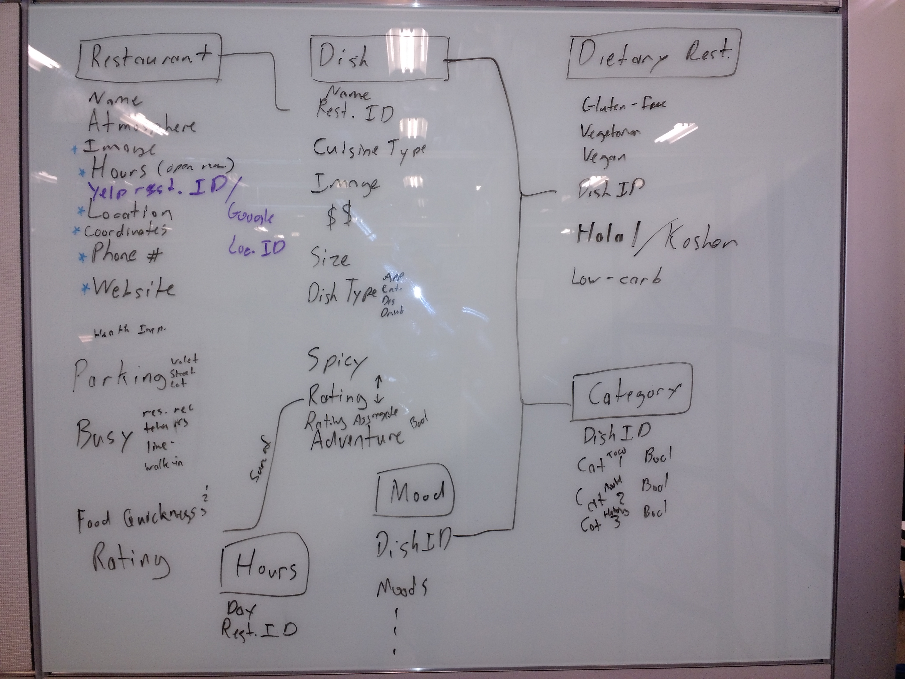
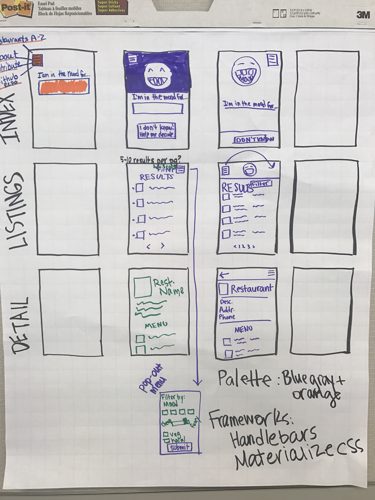
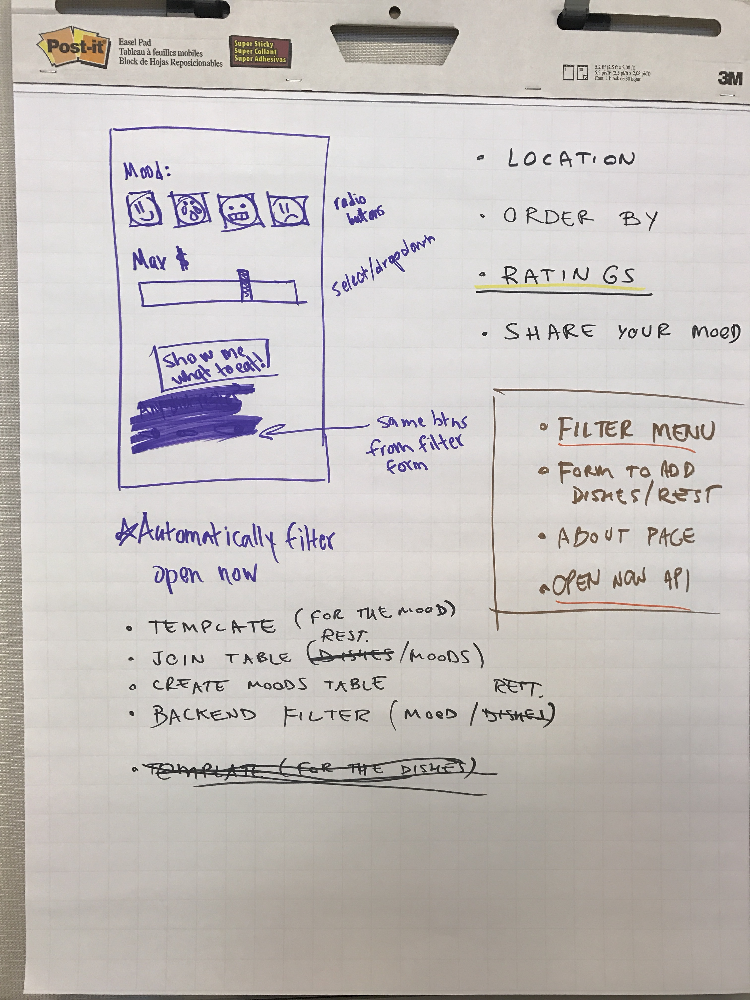
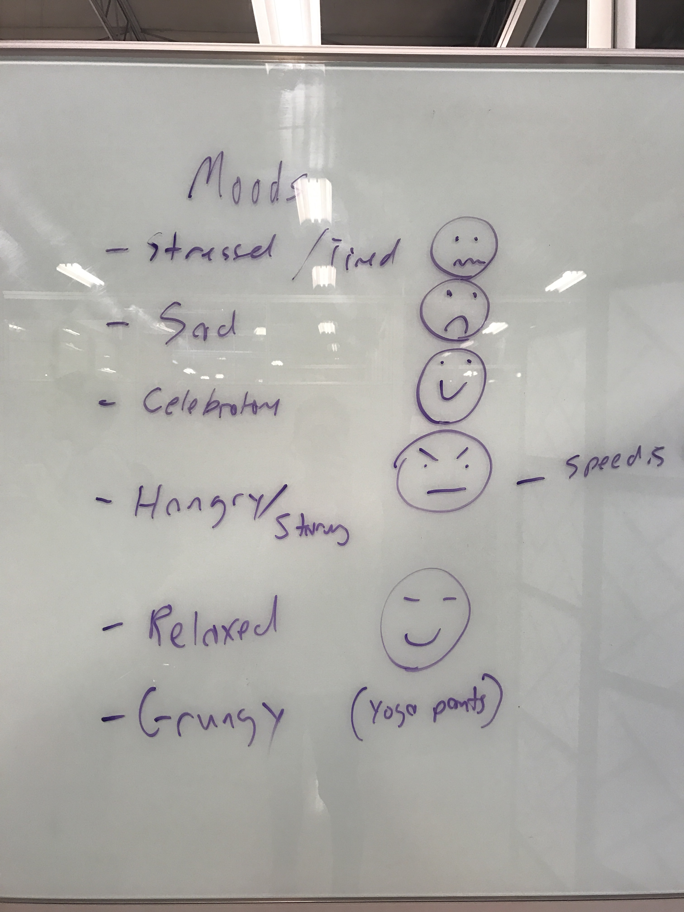

# Food for My Mood
## A Houston restaurant/food-finder app created by students at Digital Crafts
## Contributors

* [Ronda Wylie](http://wylieweb.io)
* [Ryan Leon](http://ryansimonleon.com)
* [Felipe Imanishi](http://www.fimanishi.com)
* [Aspen Hollyer](http://aspenhollyer.com)

-----

### Summary
We are a team of foodies who love to eat at local restaurants. Our app caters to like-minded folks.

We know what you're thinking: *Another food app? Seriously?*

Yes! You see, existing services such as Yelp and Urbanspoon are untrustworthy and unhelpful. Here's why:
  1. Reviews can be submitted by anyone, including restaurant employees (or competitors).
  2. Businesses can pay to improve their Yelp standing or remove negative reviews.
  3. Even honest reviews may be left by non-foodies (e.g. five-star reviews for fast food restaurants and other ridiculousness).

Existing services such as Zagat alleviate these problems, but they cater to well-known, high-end restaurants (and feature lots of snobby food critics). What about folks who want to know about the amazing tacos at the little dive across the street?

Enter **Food for My Mood**, an app written *by local foodies, for local foodies*. We take the positive crowdsourcing features of large apps like Yelp, and combine those with our own carefully curated database of restaurants and dishes. The result is the stuff foodie dreams are made of.

----

### MVP (Minimum Viable Product)
- [x] searchable database of local restaurants and dishes **- Done(ish)! Jun 21 (Ryan, Felipe)**
- [x] ability to search by food category (e.g. hot dog, taco) **- Done! Jun. 22**
- [x] ability to search by restaurant (and receive recommendations of the best dishes on the menu) **- Done! Jun. 22**

---

### Stretch Goals
- [ ] retrieve open/close hours from Google Places API, filter dishes by breakfast/lunch/dinner
- [ ] allow user to search restaurants by mood
- [ ] allow user to filter data in various ways (distance, dietary restrictions, etc.)
- [x] add Google Maps to display restaurant locations **- Done! Jun. 22 (Aspen)**
- [ ] add social media, SMS buttons to share restaurant location
- [ ] upvote/downvote buttons for restaurants, dishes
- [x] description for each restaurant **- Done! Jun. 22**
- [ ] set up caching (Redis?)
- [ ] allow multiple users to input preferences, return a suitable restaurant for them to have dinner together

------

## Group Project Week: Jun 19-26
### Monday, June 19th
Last week, we carried out a discovery meeting and did some basic project planning. Today, we set goals and decided on a high-level structure for our app.

#### Schemas and Tables
The database is the backbone of this app, so we spent a lot of time thinking about how to organize our data in a useful, efficient way.


#### Goals for Tomorrow
* Basic home page with text input, search button
* Autocomplete API
* Database with appropriate fields
* Backend communicates with Yelp API and our database

#### Challenges
* We discovered Yelp API does not provide business hours, so we will have to access these using a separate API
* Defining the database structure was difficult. We went through several iterations, deciding which tables to use and what relationships should exist among them.
* UX: The design of the homepage was difficult. At first, we provided way too many options for the user. We realized it would be a better user experience to have just a search bar on the home page. Then, users can select various options to further filter and sort data on the listing display page.

----

### Tuesday, June 20th
We hit the ground running with everyone ssh'ing into the development database to add our favorite local restaurants and dishes. We worked on making sure that our fields were useful for sorting and filtering the data. We made adjustments as needed, for example:
* changed 'Spicy' column in the Dishes table from a boolean to 1-5 scale
* added 'Busy' column to the Restaurants table with options for 'rarely', 'during peak', 'always', or 'reservation required'

#### Goals From Yesterday + Other Tasks
- [x] Basic home page with text input, ~~search button~~ **- Done! Jun. 20 (Felipe, Ronda)**
- [x] Autocomplete API **- Done! Jun. 20 (Felipe, Ronda)**
- [x] Database with appropriate fields **- Done! Jun. 20 (Ryan)**
- [x] Backend communicates with Yelp API and our database **- Done! Jun. 20 (Aspen)**
- [x] Set up deployment to Heroku **-Done! Jun. 20 (Ryan)**
- [ ] Accept search parameters, query database/Yelp, and return results to front end **- Partially complete - search by restaurant name only. Jun. 20 (Aspen)**

#### Challenges
* SQL is hard. An actual excerpt from Ryan's terminal:
```
$ q/
$ /q
$ /q
$ \q
```
* Deploying to Heroku, configuring database for production.
* Connecting a front-end JavaScript plugin to back-end and database for our autocomplete feature.
* Initial database structure did not meet our needs. We decided to implement cross-reference tables.
* Creating a search engine that will query the Yelp API only when previously cached information is more than a week old.

#### Goals for Tomorrow
* Save data from Yelp API to database
* Accept type of cuisine, category, and dietary restriction as search parameters
* Start working on UX/UI
* Render search results
* Create basic restaurant/dish detail template
* Create function to only hit Yelp API every 7 days
* Every team member: Add 10 more restaurants/dishes to database
* Merge all changes and deploy!

-----

### Wednesday, June 21st
Today, Ronda worked on the front end and design, including the logo concept. Aspen worked on the search engine, then moved to design using Google's material design. Ryan worked on the restructuring the database to meet our needs and configuring settings for production on Heroku. Felipe worked on finishing the autocomplete API, then moved to the server side, adding queries to search by food category, cuisine type, and dietary restrictions.

#### Tossing Around Design Ideas
Since people are usually on the go when looking for a restaurant, we went for a mobile-first design. There are three main templates: The search page, the listings page to display search results, and the detail page to display details for a particular restaurant.


#### Goals From Yesterday + Other Tasks
- [x] Save data from Yelp API to database **- Done! Jun. 21 (Aspen)**
- [x] Accept type of cuisine, category, and dietary restriction as search parameters **- Done! Jun. 21 (Felipe)**
- [x] Start working on UX/UI **- Done! Jun. 21 (Ronda, Aspen, Ryan)**
- [x] Render search results **- Done! Jun. 21 (Aspen, Felipe)**
- [x] Create basic restaurant/dish detail template **- Done! Jun. 22 (Aspen)**
- [x] Create function to only hit Yelp API every 7 days **- Done! Jun. 21 (Aspen)**
- [x] Add 10 more restaurants/dishes to database **Done! Jun. 21 (Aspen, Ronda, Ryan)**
- [ ] Add icons to show our tech stack
- [x] Merge all changes and deploy! **- Done! Jun. 21 (Ryan + Heroku = Magic)**

#### Challenges
* Heroku was not accepting our Yelp access token as a config variable for some reason. We had to use the Heroku Command Line Interface to force the access token.
* The production database load process had to be turned into a script so that it could be updated easily.

#### Goals for Tomorrow
* Create basic template for listings page
* Create basic template for restaurant detail page
* Add SVGs to illustrate our tech stack
* Connect backend to frontend to display search results
* Add logic to display detail page for restaurant searches, listings page for all other searches
* Create 404 page in case faulty search parameters are submitted
* Fix 503 server error on Heroku

-----

### Thursday, June 22nd
Today was our deadline to deploy a minimum viable product. We met our goal! The app is now live at [FoodForMyMood.Com](http://foodformymood.com). We still have a lot of features to add, as well as existing features to optimize.

#### Goals From Yesterday + Other Tasks
- [x] Create basic template for listings page **- Done! Jun. 22 (Aspen)**
- [x] Create basic template for restaurant detail page **- Done! Jun. 22 (Aspen)**
- [x] Customize Materialize Sass files **- Done! Jun. 22 (Ronda, Aspen)**
- [x] Finish logo **- Done! Jun. 22 (Ronda)**
- [x] Add icons to illustrate our tech stack **- Done! Jun. 22**
- [x] Connect backend to frontend to display search results **- Done! Jun. 22 (Felipe)**
- [x] Add logic to display detail page for restaurant searches, listings page for all other searches **- Done! Jun. 22 (Felipe, Aspen)**
- [ ] Create 404 page in case faulty search parameters are submitted
- [x] Fix 503 server error on Heroku **- Done! Jun. 22 (Ryan)**

#### Challenges
* Customizing the Materialize framework Sass files and recompiling them
* Creating server-side logic to differentiate searches for specific restaurants from other searches, and redirect straight to the detail page for the restaurant for a better user experience
* Writing a query to retrieve restaurants with multiple dietary restrictions. Ryan came up with this wizardry!

```sql
SELECT t1.restaurant_id
FROM (SELECT * FROM restaurant_diet_rest_join WHERE diet_rest_id = 1) as t1 JOIN
(SELECT * FROM restaurant_diet_rest_join WHERE diet_rest_id = 2) as t2 ON t1.restaurant_id = t2.restaurant_id
JOIN (SELECT * FROM restaurant_diet_rest_join WHERE diet_rest_id =3) AS t3 ON t1.restaurant_id = t3.restaurant_id;
```

* Troubleshooting Heroku production environment: the database was not connecting
* Figuring out how to filter by and update templates using handlebars partials.

#### Goals for Tomorrow
* Create a custom 404 page
* Add a mood table to the database
* Add server-side logic to search by mood
* Server-side logic to filter/order by on listings page
* Front-end logic to filter/order by on listings page
* Connect to Google Places API to get restaurant hours
* Add a map to listings and/or detail page

-----

### Friday, June 23rd


#### Goals From Yesterday + Other Tasks
- [ ] Create a custom 404 page
- [x] Create A-Z listing to browse restaurants **- Done! Jun. 23 (Ronda)**
- [x] Add a mood table to the database **- Done! Jun. 23 (Ryan)**
- [ ] Add server-side logic to search by mood
- [x] Server-side logic to filter/order by on listings page **- Partially complete! (Filter) Jun. 23 (Felipe)**
- [x] Front-end logic to filter/order by on listings page **- Done! Jun. 23 (Felipe)**
- [ ] ~~Connect to Google Places API to get restaurant hours~~
- [ ] When filtering by "open now", query Yelp-Fusion API for each restaurant in current session
- [x] Add a map to listings and/or detail page **- Done! Jun. 23 (Aspen)**
- [x] Create a form to easily add entries to the database **- Done! Jun. 23 (Ryan)**

#### Challenges
* Creating a new database table to store restaurant hours on various days of the week and writing the logic to check the table when filtering for "open now" restaurants, seemed to be more trouble than it was worth. However, we couldn't use the "open now" boolean data from the Yelp API, because we are caching data from the Yelp API for 7 days to improve performance. The solution is to send a new request to the Yelp API only when a user chooses to filter restaurants that are open now. This means it will take a little longer to check for open restaurants, but most users will experience better performance because other data from Yelp will still be cached.

---------

#### Weekend Tasks



-------

### Monday, June 26th


#### Goals From Yesterday + Other Tasks
- [ ] Create a custom 404 page
- [ ] Add server-side logic to search by mood
- [x] When filtering by "open now", query Yelp-Fusion API for each restaurant in current session **- Done! Jun. 25 (Aspen)**
- [ ] Add map of all restaurants to listings page when user filters by location?
- [ ] Add distance slider to bottom of moods page
- [ ] Get lat/long from YelpFusion API
- [x] Hide logo on search bar focus for mobile screens **- Done! Jun. 26 (Aspen)**
- [ ] Connect to Groupon, LivingSocial, etc. to check for deals
- [ ] Add server-side logic to filter by food service speed
- [ ] Add media query to shrink filters modal on med and above screens
- [ ] Increase line height on autocomplete, change blue to match existing color scheme

#### Challenges
* Creating a new database table to store restaurant hours on various days of the week and writing the logic to check the table when filtering for "open now" restaurants, seemed to be more trouble than it was worth. However, we couldn't use the "open now" boolean data from the Yelp API, because we are caching data from the Yelp API for 7 days to improve performance. The solution is to send a new request to the Yelp API only when a user chooses to filter restaurants that are open now. This means it will take a little longer to check for open restaurants, but most users will experience better performance because other data from Yelp will still be cached.


## Technologies Used
### Team Tools
 Git |  GitHub |  Atom |  Trello | Slack

### Back-End
 PostgreSQL | Postico |  Node.js | Express |  Heroku

### Front-End
 HTML5 |  CSS3 |  JavaScript |  Materialize |  Sass

### Design
 Illustrator |  Photoshop
